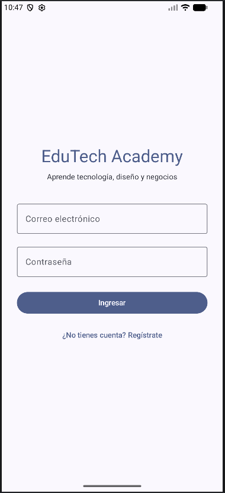
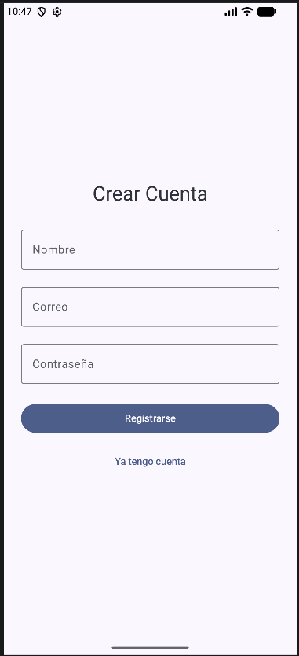
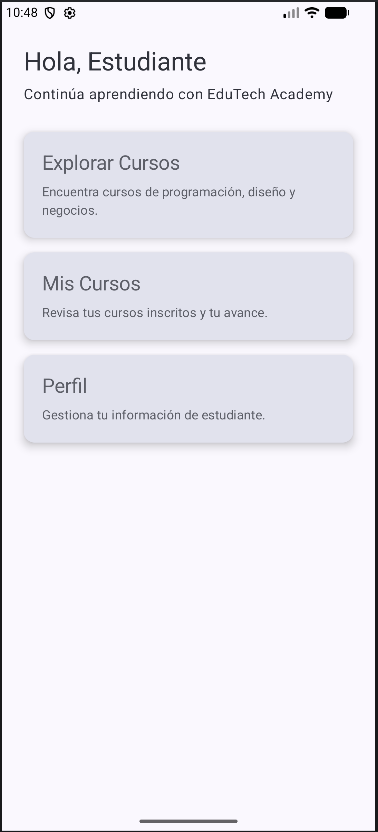
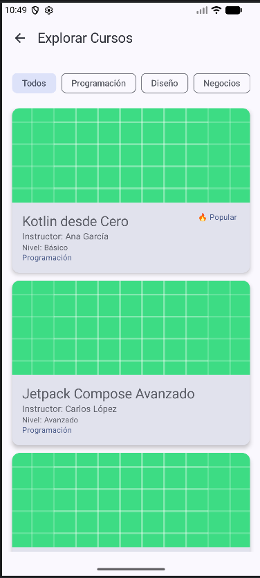
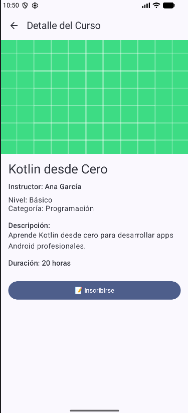
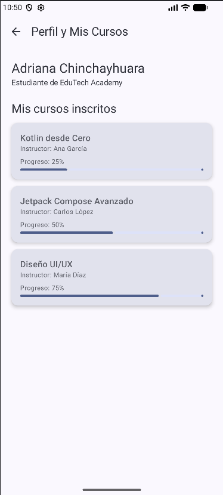

# MEJORAS CON GEMINI — EduTech Academy

## Integrantes
- Adriana Chinchayhuara
- Naomi Veliz Pie

---

# Objetivo

Mejorar la interfaz visual y la experiencia de usuario de la aplicación **EduTech Academy** utilizando Gemini en Android Studio como apoyo para auditoría UI/UX y optimización visual de las pantallas desarrolladas con Jetpack Compose.

---

# Pantallas Analizadas

Las pantallas analizadas durante la auditoría UI/UX fueron:

- LoginScreen
- HomeScreen
- CoursesScreen
- ProfileScreen

---

# Problemas Detectados Antes de las Mejoras

- Diseño visual básico y poco moderno.
- Espaciados inconsistentes entre componentes.
- Falta de jerarquía visual en títulos y textos.
- Tarjetas simples sin diseño atractivo.
- Pantallas con apariencia poco uniforme.
- Falta de etiquetas visuales para cursos destacados.
- Pantalla de login muy simple.
- Navegación visual poco intuitiva.
- Falta de imágenes en cursos y detalles.

---

# Prompt Utilizado en Gemini

```text
[Pega aquí el prompt completo utilizado en Gemini]
```

---

# Mejoras Implementadas

## 1. Mejora de Jerarquía Visual

- Se mejoraron tamaños de títulos y subtítulos.
- Se reorganizó el contenido visualmente.
- Se aplicaron mejores espaciados y alineaciones.

---

## 2. Rediseño de Tarjetas

- Se agregaron bordes redondeados modernos.
- Se mejoraron sombras y elevaciones.
- Se aplicó mejor padding interno.
- Se mejoró la organización visual de la información.

---

## 3. Mejora de Login y Registro

- Se modernizaron los formularios.
- Se mejoró el diseño de botones e inputs.
- Se aplicó una apariencia más profesional.

---

## 4. Mejora de HomeScreen

- Se modernizó el dashboard principal.
- Se mejoró la distribución visual de accesos rápidos.
- Se mejoró la uniformidad visual.

---

## 5. Mejora de CoursesScreen

- Se integraron imágenes en los cursos.
- Se mejoró visualmente el catálogo de cursos.
- Se agregaron etiquetas visuales:
    - "Popular"
    - "Nuevo"

---

## 6. Mejora de ProfileScreen

- Se mejoró la visualización de cursos inscritos.
- Se mejoró la barra de progreso.
- Se mejoró la organización visual de la información del usuario.

---

## 7. Navegación Mejorada

- Se agregó flecha de retorno en pantallas secundarias.
- Se mantuvo navegación con Navigation Compose.

---

# Capturas — Antes vs Después

## LoginScreen

### Antes



### Después


---

# RegisterScreen

### Antes



### Después


---

## HomeScreen

### Antes



### Después


---

## CoursesScreen

### Antes



### Después


---


## DetailScreen

### Antes



### Después


---

## ProfileScreen

### Antes



### Después


---

# Reflexión

El uso de Gemini permitió identificar problemas visuales y mejorar significativamente la experiencia de usuario de la aplicación. Gracias a las recomendaciones generadas, se logró una interfaz más moderna, uniforme y profesional manteniendo la funcionalidad existente del proyecto.

Además, el apoyo de Gemini facilitó la aplicación de buenas prácticas de diseño UI/UX en Jetpack Compose sin afectar la arquitectura ni la navegación implementada previamente.

---

# Evidencias

Las capturas utilizadas como evidencia deben almacenarse dentro de una carpeta llamada:

```text
doc/
```

Ejemplo:

```text
doc/login_antes.png
doc/login_despues.png
doc/home_antes.png
doc/home_despues.png
```

---

# Cómo agregar imágenes en el archivo .md

Para insertar imágenes en Markdown se usa:

```md

```

Ejemplo:

```md

```

La imagen debe existir realmente en esa ruta para que se visualice correctamente en GitHub.
